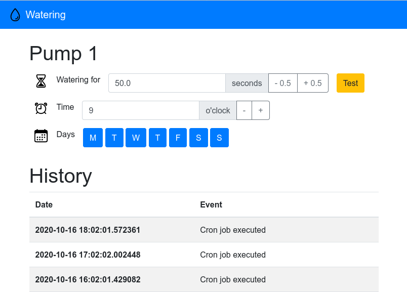

# Watering

Raspberry pi powered plant watering system

* Web UI for setup of pumps
* Event log for pump changes and activation

## Software

* Python 3
* Flask
* gpiozero
* SQLite3 database

## Hardware

* Raspberry Pi3 Model B
* L298N dual motor controller
* DollaTek Mini Water Pump (DC Motor)
* 6/8mm plastic tube
* Gardena Straight Reducing Joint 6-4mm
* 6/4mm plastic tube

## Licenses

Code released under GPL3

Icons from https://ionicons.com/ under MIT License
